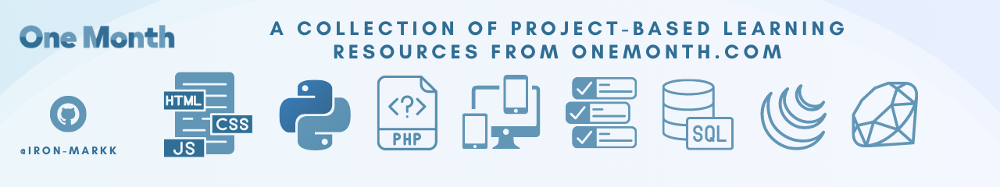

# tuts-OneMonth-Projects

- Welcome! This repository serves as a collection of projects completed during my journey with [OneMonth.com](OneMonth.com) 
- Huge thanks to the [Github Education Benifits](https://education.github.com/benefits?type=student)
- Each project focuses on a different topic or technology, allowing me to demonstrate my skills and progress in various areas.

## Project Categories

1. **HTML & CSS**: Dive into web development with projects showcasing HTML and CSS skills.
2. **Python**: Explore the world of Python programming with hands-on projects.
3. **WordPress**: Build dynamic and customized websites using WordPress.
4. **Responsive Design**: Learn how to create responsive websites that adapt to different devices.
5. **JavaScript**: Harness the power of JavaScript by working on interactive and dynamic projects.
6. **Project Management**: Discover project management methodologies and tools through practical projects.
7. **SQL**: Get hands-on experience with databases and SQL queries.
8. **jQuery**: Learn how to enhance websites using the popular jQuery library.
9. **jQuery**: Learn how to enhance websites using the popular jQuery library.
10. **Ruby**: Master the Ruby programming language through engaging projects.

## Project Organization

Each project category has its own dedicated folder within this repository. To explore a specific project, follow these steps:

1. Navigate to the corresponding project category folder.
2. Open the project folder that interests you.
3. Read the project's README file for an overview, instructions, and additional information.

Feel free to explore the projects, examine the source code, and utilize any resources provided. 
Each project folder contains all the necessary files to understand and reproduce the project's results.

## Contributions

- While this repository is primarily for personal use and documentation purposes, I welcome any suggestions or improvements you may have. 
- If you come across any issues or have ideas to enhance the projects, feel free to create an issue in the repository. 
- Your feedback is greatly appreciated!

## License & Disclaimer

- This repository is licensed under the [MIT License](LICENSE). 
- You are free to use, modify, and distribute the projects in this repository as per the terms of the MIT License.
- Refer to the individual project's documentation for specific details. 
- All projects are intended for educational purposes only.

**Disclaimer**

- Please note that any media (images, videos, audios) used in the projects are for illustrative purposes only and are not meant for copyright infringement or any commercial gain. 
- The media used are either sourced from free stock photo websites or created specifically for the project. 
- If you intend to reuse or distribute any images, ensure that you comply with the appropriate licenses and usage restrictions.

## Sitenote

Thank you for visiting, I hope you find value in the projects and the skills they represent.
